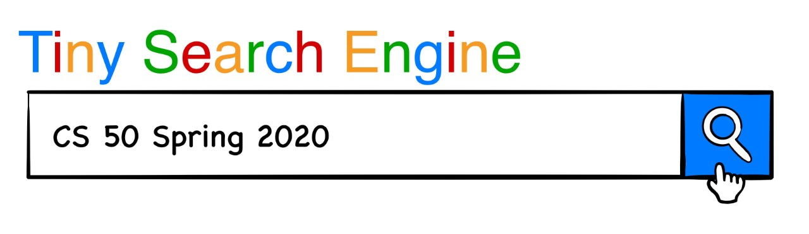

### Lizzie Hernandez Videa
#### GitHub username: lizziehv

~ This is the repository for the Tiny Search Engine (TSE). ~

To build, clone this repository, and run `make` from tse directory.
To clean up, run `make clean`.

The TSE consists of three modules labeled crawler, indexer, and querier. 
See [Crawler README](./crawler/README.md) for information on crawler. 
See [Indexer README](./crawler/README.md) for information on indexer. 
See [Querier README](./crawler/README.md) for information on querier. 

For building and testing each of the components go into their corresponding directories and
run `make` or `make all` (see READMEs  for instructions) and `make test`.

Each of the three directories *crawler*, *indexer*, and *querier* contains

- Documentation:
    - README - general information
    - REQUIREMENTS - basic requirements for the program 
    - DESIGN - design plan for the program
    - IMPLEMENTATION - details about program implementation, including data structures, pseudocode, resource management, dependencies, etc.

- Program:
    - .c and .h files for the program and any other programs used

- Testing script
    - `testing.sh` to test the commands 
    - any other testing files needed for `testing.sh`

Libraries used are [common](./common/common.a) and [libcs50](./libcs50/libcs50.a), found in common/ and libcs50/, respectively. Each can be compiled by running `make` from the directory root.
